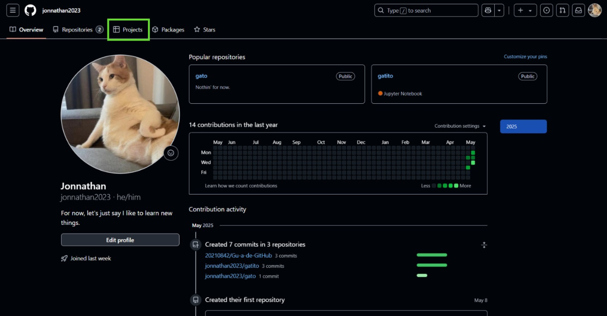
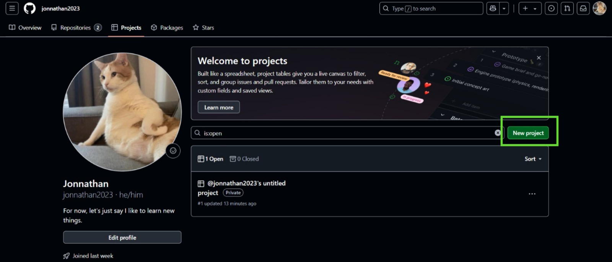
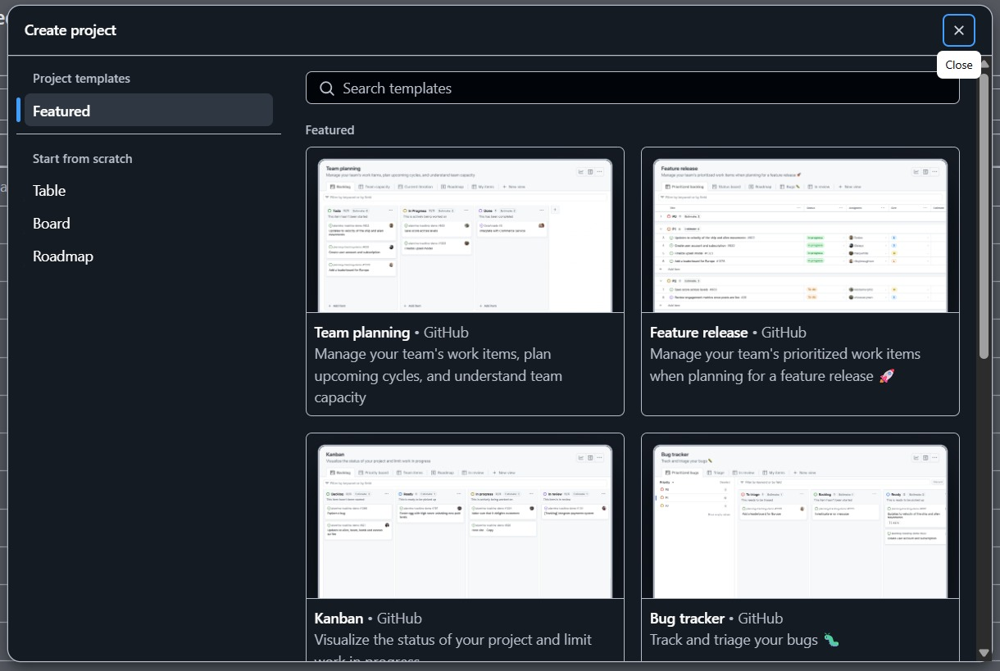
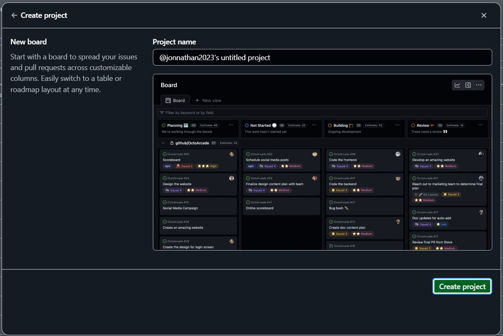
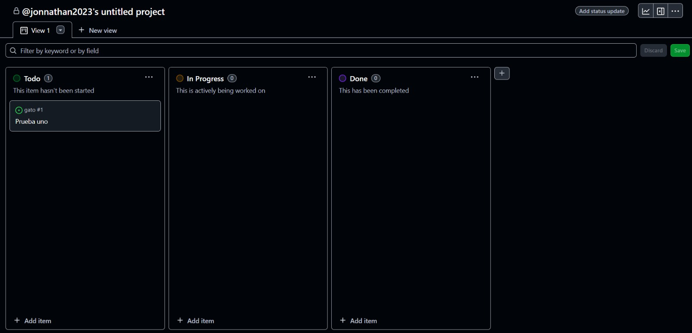

# Guía Básica de GitHub

Esta guía te ayudará a comprender algunas funciones clave de GitHub: **Issues** , **Pull Requests** , **Gestion de proyectos con GitHub** y **creacion de pagina en GitHub**. Estas son herramientas esenciales para colaborar en proyectos, gestionar tareas y mantener un flujo de trabajo eficiente.

---
##  Índice de la Guía Básica de GitHub

1. [Issues](#1-issues)  
   - [¿Cómo crear un Issue?](#cómo-crear-un-issue)  
   - [¿Para qué se usan?](#para-qué-se-usan)

2. [Pull Requests](#2-pull-requests)  
   - [¿Cómo crear un Pull Request?](#cómo-crear-un-pull-request)  
   - [¿Para qué se usan?](#para-qué-se-usan-1)

3. [Gestión de Proyectos con GitHub Projects](#3-gestión-de-proyectos-con-github-projects)  
   - [¿Qué es?](#qué-es)  
   - [Tipos de proyectos](#tipos-de-proyectos)  
   - [¿Cómo crear un proyecto?](#cómo-crear-un-proyecto)  
   - [Añadir elementos](#añadir-elementos)  
   - [Flujo sugerido](#flujo-sugerido)  
   - [Mejores prácticas](#mejores-prácticas)

4. [Cómo Crear Ambos Tipos de Páginas en GitHub Pages](#4-cómo-crear-ambos-tipos-de-páginas-en-github-pages)  
   - [Parte 1: Crear un sitio personal (usuario)](#parte-1-crear-un-sitio-personal-usuario)  
     - [Paso 1: Crear el repositorio personal](#paso-1-crear-el-repositorio-personal)  
     - [Paso 2: Agregar los archivos del sitio](#paso-2-agregar-los-archivos-del-sitio)  
     - [Paso 3: Activar GitHub Pages](#paso-3-activar-github-pages)  
   - [Parte 2: Crear un sitio de proyecto](#parte-2-crear-un-sitio-de-proyecto)  
     - [Paso 1: Crear un repositorio](#paso-1-crear-un-repositorio)  
     - [Paso 2: Subir tus archivos del sitio](#paso-2-subir-tus-archivos-del-sitio)  
     - [Paso 3: Activar GitHub Pages](#paso-3-activar-github-pages-1)  
     - [Resultado final](#resultado-final)

## 1. Issues

Los *issues* (problemas) son una forma de reportar errores, proponer mejoras o discutir ideas relacionadas con un proyecto.

### ¿Cómo crear un Issue?

1. Ve al repositorio donde quieres crear el issue.
   

2. Haz clic en la pestaña **Issues**.
   

3. Haz clic en el botón **New Issue**.
   

4. Escribe un título claro y una descripción detallada del problema o sugerencia.
   

5. Haz clic en **Create**.
    


### ¿Para qué se usan?

- Reportar bugs (errores).
- Sugerir nuevas funcionalidades.
- Hacer preguntas o iniciar una discusión.
- Asignar tareas a miembros del equipo.

---

## 2. Pull Requests

Un *pull request* (solicitud de extracción) se utiliza para proponer cambios en el código. Permite revisar, comentar y fusionar cambios en la rama principal del repositorio.

### ¿Cómo crear un Pull Request?

1. Haz un *fork* (si no tienes acceso al repositorio original) o crea una nueva rama desde `main`.
   
   
   
   
   

3. Realiza los cambios en esa rama y haz un **commit**.
   
 
4. Ve a la pestaña **Pull Requests** y haz clic en **New Pull Request**.
   

5. Compara la rama base (`main`) con tu rama con cambios.
   

   

6. Agrega un título y una descripción explicando los cambios realizados.
    

7. Haz clic en **Create Pull Request**.
    


### ¿Para qué se usan?

- Proponer nuevas características o correcciones.
- Revisar y comentar el código antes de fusionarlo.
- Asegurar calidad mediante revisiones por parte del equipo.

## 3. Gestión de Proyectos con GitHub Projects

### ¿Qué es?

Es una herramienta para visualizar y organizar tareas mediante tableros o tablas personalizadas.

### Tipos de proyectos

- Clásico (deprecated)
- Nuevo GitHub Projects (más flexible y automatizable)

### ¿Cómo crear un proyecto?

1. Ve a la pestaña **Projects**.

2. Haz clic en **New Project**.

3. Elige tipo de vista: tablero o tabla.

4. Nombra y configura el proyecto.



### Añadir elementos

- Agrega Issues, PRs o tarjetas libres.
- Usa columnas: *To do*, *In progress*, *Done*.
- Mueve tarjetas para reflejar el estado.

### Flujo sugerido

1. Crear un Issue.
2. Añadirlo al proyecto.
3. Moverlo entre columnas según el progreso.
4. Vincularlo con un PR.
5. Cerrar el Issue con el merge del PR.

### Mejores prácticas

- Actualiza el tablero regularmente.
- Usa etiquetas y prioridades.
- Divide tareas complejas.
- Usa automatizaciones.

## 4. Cómo Crear Ambos Tipos de Páginas en GitHub Pages

###  Parte 1: Crear un sitio personal (usuario)

Este sitio se publica en `https://TU-USUARIO.github.io`  
 - Solo puedes tener **uno** por cuenta.


#### Paso 1: Crear el repositorio personal

1. Inicia sesión en GitHub.
2. Haz clic en **New Repository**.
3. Nombre del repositorio:  
   ➤ Debe llamarse exactamente: `tu-usuario.github.io`  
   (Reemplaza `"tu-usuario"` por tu nombre de usuario real de GitHub.)
4. Hazlo público.
5. Marca **"Add a README"** si quieres.
6. Clic en **Create repository**.


#### Paso 2: Agregar los archivos del sitio

Puedes hacerlo de dos formas:

##### - Opción A: Usando la interfaz web

1. Clic en **Add file > Upload files**.
2. Sube tu archivo `index.html` y otros recursos (CSS, imágenes, etc.).
3. Clic en **Commit changes**.

##### - Opción B: Desde tu computadora (con Git instalado)

```bash
git clone https://github.com/TU-USUARIO/tu-usuario.github.io.git
cd tu-usuario.github.io
# Agrega tus archivos del sitio (index.html, styles.css, etc.)
git add .
git commit -m "Mi sitio personal"
git push origin main
```

####  Paso 3: Activar GitHub Pages
1. En tu repositorio, ve a Settings > Pages.
2. En Source, selecciona main y / (root) o /docs si usas una carpeta específica.
3. Haz clic en Save.

 Tu sitio estará disponible en: `https://tu-usuario.github.io/calculadora-html`

### Parte 2: Crear un sitio de proyecto

Este tipo de sitio se publica en una URL como:  
 `https://tu-usuario.github.io/nombre-del-repositorio`

Puedes tener tantos como desees.


#### Paso 1: Crear un repositorio

1. Haz clic en **New Repository**.  
2. Ponle un nombre cualquiera (por ejemplo, `calculadora-html`).  
3. Hazlo público.  
4. Marca **"Add a README"** si quieres.  
5. Clic en **Create repository**.


#### Paso 2: Subir tus archivos del sitio

- Incluye al menos un archivo `index.html`.  
- Sube archivos desde la web o usa Git local como en el paso anterior.


#### Paso 3: Activar GitHub Pages

1. En tu repositorio, ve a **Settings > Pages**.  
2. En **Source**, selecciona `main` y `/` (root) o `/docs` si usas una carpeta específica.  
3. Haz clic en **Save**.

 Tu sitio estará disponible en:
`https://tu-usuario.github.io/calculadora-html`

Resultado final
Tendrás dos sitios publicados:
| Sitio    | URL                                    | Tipo              |
| -------- | -------------------------------------- | ----------------- |
| Personal | `https://tu-usuario.github.io`         | Sitio de usuario  |
| Proyecto | `https://tu-usuario.github.io/nombre/` | Sitio de proyecto |

